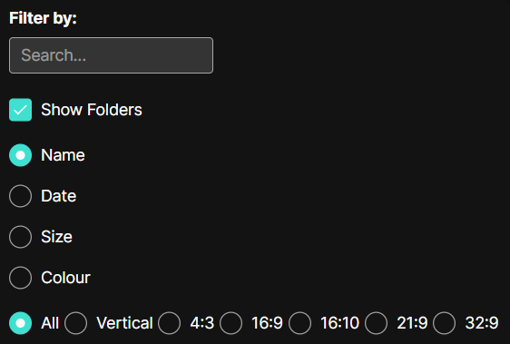
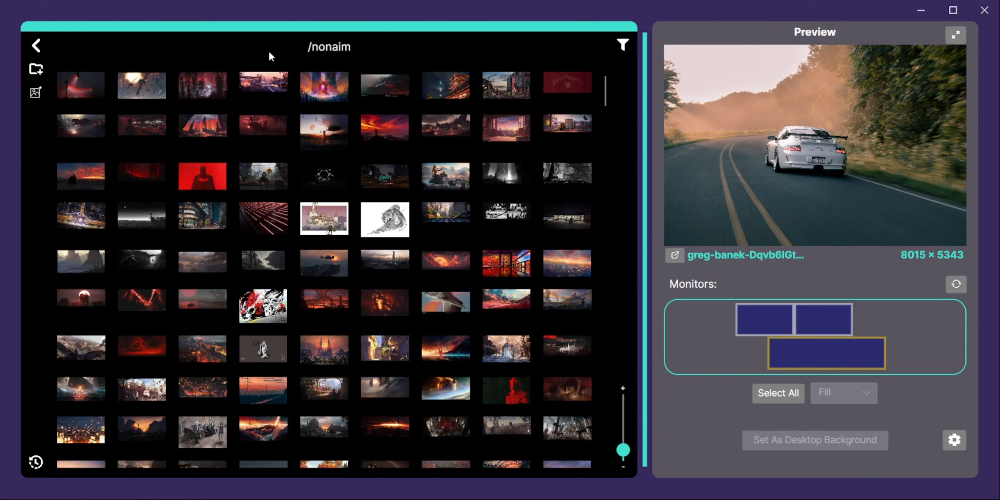
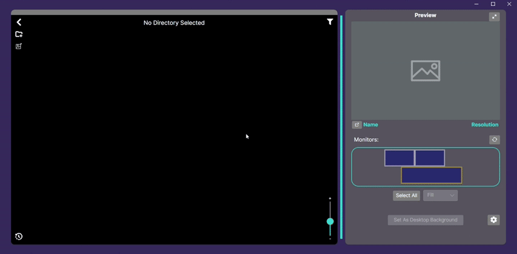
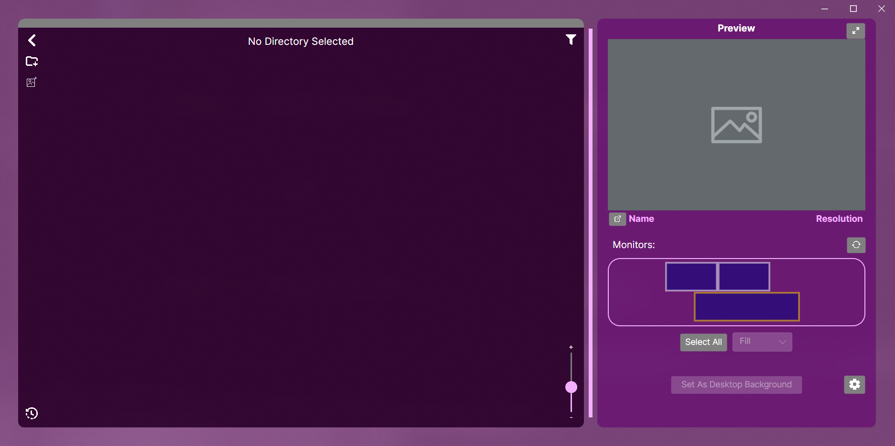
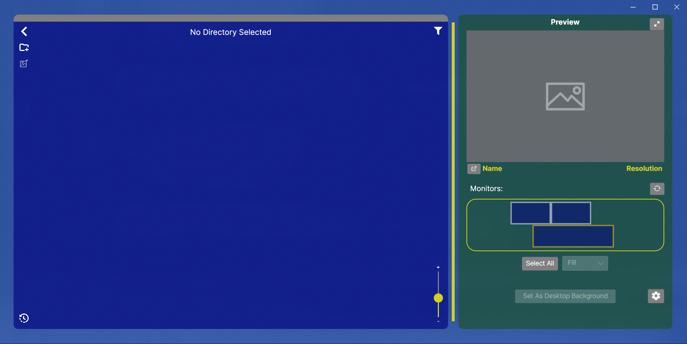

  <h1>WallMod</h1>

## Description
Wallpaper browser that uses your own image files. Does NOT run in the background - sets backgrounds natively. Inspired by WallpaperEngine. 
  
Currently being developed - in proficient state
  

## Supported OSs
- Windows 10+
- Linux (most DEs)
  

## Instructions
- install and run executable that corresponds to your system [here](https://github.com/DefrimBinakaj/WallMod/releases)
  

## Preview of features
 
- Loads directories and/or selected images <code>(png/jpg/jpeg/bmp)</code> from your file explorer with layout resizability

  

  

- Enlarge image and move the window to preview wallpapers on different monitors without setting it

  

  

- Choose a specific area (position and size of rectangle) to set the background of a monitor to

  

  

- Utilize filtering and sorting to browse through your images easier

  
  

  

- History of all images that were used to set your background are saved and can be reused

  

  

- Browse through your computers directory and file system through the app with double-clicking   (back arrow = 'cd ..')

  

  

- Change startup, system, and theme settings

  

  

- Customize to your heart's content!

  
  

  

## Additional features:
- Compatible with **ALL** sizes of images - both loading and background setting
- Multithreaded if desired; prioritizes low idle memory consumption
- Does not require to be running in order to keep background; sets it natively

